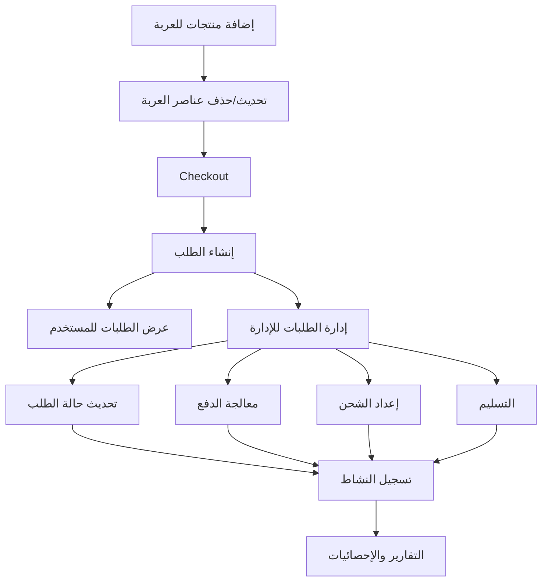

# تقرير API: نظام إدارة الطلبات (Order Management)

## مقدمة
نظام إدارة الطلبات في هذا المشروع مبني على Django REST Framework ويدعم دورة حياة الطلبات بشكل كامل بدءًا من إضافة المنتجات إلى العربة، ثم إنشاء الطلب، متابعة حالته، الإلغاء، والتتبع، مع دعم المنتجات الرقمية والمادية. كما يوفر نظام إدارة متكامل من لوحة التحكم مع صلاحيات وأدوار محددة.

---

## 1. النماذج الأساسية (Models)

### 1.1. Order (الطلب)
- يمثل الطلب النهائي بعد الشراء.
- الحقول الأساسية:
  - `user`: المستخدم صاحب الطلب (ForeignKey إلى User)
  - `status`: حالة الطلب (pending, confirmed, shipped, delivered, cancelled ...)
  - `subtotal`: المجموع الفرعي (DecimalField, max_digits=10, decimal_places=2)
  - `tax_amount`: مبلغ الضريبة (DecimalField, default=Decimal('0.00'))
  - `shipping_cost`: تكلفة الشحن (DecimalField, default=Decimal('0.00'))
  - `shipping_method`: طريقة الشحن (ForeignKey إلى ShippingMethod)
  - `discount_amount`: مبلغ الخصم (DecimalField, default=Decimal('0.00'))
  - `total_amount`: المبلغ الإجمالي (DecimalField)
  - `payment_method`: طريقة الدفع (CharField, max_length=50, choices=StoreConstants.PAYMENT_METHODS)
  - `payment_status`: حالة الدفع (CharField, max_length=20, choices=StoreConstants.PAYMENT_STATUSES, default='pending')
  - `payment_intent_id`: معرف الدفع (CharField, max_length=255, blank=True)
  - `notes`: ملاحظات (TextField, blank=True)
  - `paid_at`: تاريخ الدفع (DateTimeField, null=True, blank=True)
  - `shipped_at`: تاريخ الشحن (DateTimeField, null=True, blank=True)
  - `delivered_at`: تاريخ التسليم (DateTimeField, null=True, blank=True)
  - عنوان الشحن (street_address, city, state_province, postal_code, country) من AddressInfo

**الخصائص (Properties):**
- `order_number`: رقم الطلب (ORD-YYYYMMDD-XXXXXXXX)
- `has_physical_items`: فحص وجود منتجات مادية
- `has_digital_items`: فحص وجود منتجات رقمية
- `is_paid`: فحص إذا كان الطلب مدفوع
- `can_be_cancelled`: فحص إمكانية إلغاء الطلب

**الطرق (Methods):**
- `mark_as_paid()`: تأكيد الدفع وتحديث الحالة
- `cancel(reason=None)`: إلغاء الطلب مع سبب

### 1.2. OrderItem (عنصر الطلب)
- يمثل منتجًا داخل الطلب.
- يدعم المنتجات الرقمية والمادية عبر GenericForeignKey.
- الحقول الأساسية:
  - `order`: الطلب (ForeignKey إلى Order)
  - `content_type`: نوع المنتج (ForeignKey إلى ContentType)
  - `object_id`: معرف المنتج (UUIDField)
  - `product`: المنتج (GenericForeignKey)
  - `purchase_type`: نوع الشراء (CharField, max_length=20, choices=StoreConstants.PRODUCT_TYPES, default='digital')
  - `quantity`: الكمية (PositiveIntegerField, default=1)
  - `unit_price`: سعر الوحدة (DecimalField, max_digits=10, decimal_places=2)
  - `total_price`: السعر الإجمالي (DecimalField, max_digits=10, decimal_places=2)
  - `download_limit`: حد التنزيل (PositiveIntegerField, default=5)
  - `download_count`: عدد التنزيلات (PositiveIntegerField, default=0)
  - `watermark_text`: نص العلامة المائية (CharField, max_length=255, blank=True)

**الخصائص (Properties):**
- `product_title`: عنوان المنتج
- `can_download`: فحص إمكانية التنزيل

**الطرق (Methods):**
- `increment_download_count()`: زيادة عداد التنزيل
- `save()`: حفظ مع حساب السعر الإجمالي

### 1.3. ShippingAddress (عناوين الشحن)
- لإدارة عناوين الشحن المحفوظة للمستخدم.
- الحقول الأساسية:
  - `user`: المستخدم (ForeignKey إلى User)
  - `label`: تسمية العنوان (CharField, max_length=50, help_text='مثل: البيت، العمل، إلخ')
  - `first_name`: الاسم الأول (CharField, max_length=100)
  - `last_name`: الاسم الأخير (CharField, max_length=100)
  - `company`: الشركة (CharField, max_length=100, blank=True)
  - `address_line_1`: العنوان الأول (CharField, max_length=255)
  - `address_line_2`: العنوان الثاني (CharField, max_length=255, blank=True)
  - `city`: المدينة (CharField, max_length=100)
  - `state`: المحافظة/المنطقة (CharField, max_length=100)
  - `postal_code`: الرمز البريدي (CharField, max_length=20)
  - `country`: البلد (CharField, max_length=100, default='Jordan')
  - `phone`: رقم الهاتف (CharField, max_length=20)
  - `is_default`: العنوان الافتراضي (BooleanField, default=False)

**الخصائص (Properties):**
- `full_name`: الاسم الكامل
- `full_address`: العنوان الكامل

**الطرق (Methods):**
- `save()`: حفظ مع التحقق من العنوان الافتراضي

### 1.4. ShippingMethod (طرق الشحن)
- لإدارة طرق الشحن المتاحة.
- الحقول الأساسية:
  - `name`: اسم طريقة الشحن (CharField, max_length=100, unique=True, help_text='مثال: شحن سريع، شحن عادي')
  - `description`: الوصف (TextField, blank=True, help_text='وصف تفصيلي لطريقة الشحن')
  - `price`: السعر (DecimalField, max_digits=10, decimal_places=2, validators=[MinValueValidator(Decimal('0.00'))], help_text='تكلفة الشحن لهذه الطريقة')
  - `estimated_delivery_time`: وقت التسليم المقدر (CharField, max_length=100, blank=True, help_text='مثال: 2-5 أيام عمل')
  - `is_active`: نشط (BooleanField, default=True, help_text='هل طريقة الشحن هذه نشطة ومتاحة للاستخدام')

**الطرق (Methods):**
- `__str__()`: إرجاع اسم طريقة الشحن

### 1.5. Cart (عربة التسوق)
- عربة التسوق الموحدة التي تدعم منتجات من تطبيقات مختلفة.
- الحقول الأساسية:
  - `user`: المستخدم (OneToOneField إلى User, related_name='shopping_cart')
  - `session_key`: مفتاح الجلسة (CharField, max_length=40, blank=True, help_text='لدعم العربات للمستخدمين غير المسجلين')

**الخصائص (Properties):**
- `total_items`: إجمالي عدد العناصر
- `total_price`: إجمالي السعر
- `has_physical_items`: فحص وجود منتجات مادية
- `has_digital_items`: فحص وجود منتجات رقمية

**الطرق (Methods):**
- `clear()`: مسح جميع العناصر من العربة
- `add_item(product, quantity=1, purchase_type='digital', **kwargs)`: إضافة عنصر إلى العربة
- `remove_item(product, purchase_type='digital')`: إزالة عنصر من العربة
- `update_item_quantity(item_id, quantity)`: تحديث كمية عنصر

### 1.6. CartItem (عنصر العربة)
- عنصر في عربة التسوق يدعم أي نوع من المنتجات.
- الحقول الأساسية:
  - `cart`: العربة (ForeignKey إلى Cart, related_name='items')
  - `content_type`: نوع المنتج (ForeignKey إلى ContentType)
  - `object_id`: معرف المنتج (UUIDField)
  - `product`: المنتج (GenericForeignKey)
  - `purchase_type`: نوع الشراء (CharField, max_length=20, choices=StoreConstants.PRODUCT_TYPES, default='digital')
  - `quantity`: الكمية (PositiveIntegerField, default=1, validators=[MinValueValidator(1)])
  - `unit_price`: سعر الوحدة (DecimalField, max_digits=10, decimal_places=2, validators=[MinValueValidator(Decimal('0.01'))])
  - `discount_amount`: مبلغ الخصم (DecimalField, max_digits=10, decimal_places=2, default=Decimal('0.00'))
  - `added_at`: تاريخ الإضافة (DateTimeField, auto_now_add=True)

**الخصائص (Properties):**
- `total_price`: السعر الإجمالي للعنصر
- `product_title`: عنوان المنتج

**الطرق (Methods):**
- `save()`: حفظ مع تحديث السعر

---

## 2. نظام الإدارة والصلاحيات (Admin System)

### 2.1. الأدوار الإدارية (Admin Roles)
```python
ROLE_TYPES = [
    ('super_admin', 'مدير عام'),
    ('store_admin', 'مدير المتجر'),
    ('category_manager', 'مدير الفئات'),
    ('product_manager', 'مدير المنتجات'),
    ('order_manager', 'مدير الطلبات'),  # ← دور إدارة الطلبات
    ('customer_service', 'خدمة العملاء'),
    ('viewer', 'مشاهد فقط'),
]
```

### 2.2. صلاحيات إدارة الطلبات
- **order_manager**: صلاحيات كاملة لإدارة الطلبات
- **store_admin**: صلاحيات إدارية شاملة تشمل الطلبات
- **customer_service**: صلاحيات محدودة لعرض وتحديث الطلبات

### 2.3. نموذج AdminUser
```python
class AdminUser(BaseStoreModel):
    id = models.UUIDField(primary_key=True, default=uuid.uuid4, editable=False)
    user = models.ForeignKey(settings.AUTH_USER_MODEL, on_delete=models.CASCADE, related_name='admin_profiles', verbose_name=_('المستخدم'))
    role = models.ForeignKey(Role, on_delete=models.CASCADE, related_name='admin_users', verbose_name=_('الدور الإداري'))
    assigned_at = models.DateTimeField(_('تاريخ التعيين'), auto_now_add=True)
    assigned_by = models.ForeignKey(settings.AUTH_USER_MODEL, on_delete=models.SET_NULL, null=True, blank=True, related_name='assigned_admin_users', verbose_name=_('عُين بواسطة'))
    expires_at = models.DateTimeField(_('تاريخ انتهاء الصلاحية'), null=True, blank=True, help_text=_('اتركه فارغاً للصلاحية الدائمة'))
    notes = models.TextField(_('ملاحظات'), blank=True)
    
    class Meta:
        verbose_name = _('مستخدم إداري')
        verbose_name_plural = _('المستخدمين الإداريين')
        unique_together = ['user', 'role']
        ordering = ['-assigned_at']
    
    def __str__(self):
        return f"{self.user.email} - {self.role.name}"
    
    @property
    def is_expired(self):
        """فحص انتهاء الصلاحية"""
        if not self.expires_at:
            return False
        from django.utils import timezone
        return timezone.now() > self.expires_at
```

---

## 3. واجهات الإدارة (Admin Interface)

### 3.1. OrderAdmin (إدارة الطلبات)
```python
@admin.register(Order)
class OrderAdmin(admin.ModelAdmin):
    list_display = [
        'order_number', 'user', 'status', 'payment_status', 
        'total_amount', 'created_at'
    ]
    list_filter = ['status', 'payment_status', 'created_at']
    search_fields = ['user__email', 'user__first_name', 'user__last_name']
    readonly_fields = ['order_number', 'created_at', 'updated_at']
    
    fieldsets = (
        ('Order Information', {
            'fields': ('user', 'status', 'payment_status')
        }),
        ('Financial Details', {
            'fields': ('subtotal', 'tax_amount', 'shipping_cost', 'discount_amount', 'total_amount')
        }),
        ('Payment Information', {
            'fields': ('payment_method', 'payment_intent_id', 'paid_at')
        }),
        ('Shipping Information', {
            'fields': ('shipped_at', 'delivered_at')
        }),
        ('Additional Info', {
            'fields': ('notes',),
            'classes': ('collapse',)
        }),
        ('Timestamps', {
            'fields': ('created_at', 'updated_at'),
            'classes': ('collapse',)
        })
    )
    
    inlines = [OrderItemInline]
    
    def get_queryset(self, request):
        return super().get_queryset(request).select_related('user').prefetch_related('items')
```

### 3.2. OrderItemAdmin (إدارة عناصر الطلب)
```python
@admin.register(OrderItem)  
class OrderItemAdmin(admin.ModelAdmin):
    list_display = [
        'order', 'get_product_title', 'quantity', 
        'unit_price', 'total_price', 'download_count', 'download_limit'
    ]
    list_filter = ['content_type', 'purchase_type', 'created_at']
    search_fields = ['order__user__email']
    readonly_fields = ['unit_price', 'total_price', 'created_at']
    
    def get_product_title(self, obj):
        """Get product title"""
        if obj.product:
            return getattr(obj.product, 'title', str(obj.product))
        return 'Unknown Product'
    get_product_title.short_description = 'Product'
```

---

## 4. الفلو الكامل (Order Flow)

### 4.1. فلو المستخدم العادي
1. **إضافة المنتجات للعربة**
   - عبر `/api/store_cart/carts/{id}/add_item/` أو `/api/store_cart/add/`
2. **تحديث/حذف عناصر العربة**
   - `/api/store_cart/carts/{id}/update_item/`, `/remove_item/`, `/clear/`
3. **إنشاء الطلب (Checkout)**
   - POST `/api/store_cart/carts/{id}/checkout/`
   - يقرأ العنوان من البيانات أو من عنوان افتراضي.
   - ينقل كل عناصر العربة إلى الطلب.
4. **عرض الطلبات**
   - GET `/api/store_cart/orders/` (قائمة ملخص الطلبات)
   - GET `/api/store_cart/orders/{id}/` (تفاصيل الطلب)
5. **إلغاء الطلب**
   - POST `/api/store_cart/orders/{id}/cancel/` (إذا كانت الحالة تسمح)
6. **تتبع الطلب**
   - GET `/api/store_cart/orders/{id}/tracking/`
7. **تاريخ الطلبات**
   - GET `/api/store_cart/order_history/` (آخر 10 طلبات)

### 4.2. فلو الإدارة
1. **تسجيل دخول الإدارة**
   - المصادقة عبر JWT أو Session
   - التحقق من الصلاحيات الإدارية
2. **عرض قائمة الطلبات**
   - تصفية حسب الحالة، التاريخ، المستخدم
   - البحث في الطلبات
3. **تحديث حالة الطلب**
   - تغيير الحالة (pending → confirmed → shipped → delivered)
   - إضافة ملاحظات إدارية
4. **إدارة عناصر الطلب**
   - عرض تفاصيل المنتجات المشتراة
   - تتبع التنزيلات للمنتجات الرقمية
5. **إدارة الدفع**
   - تحديث حالة الدفع
   - إضافة معرف الدفع
6. **إدارة الشحن**
   - تحديث معلومات الشحن
   - إضافة رقم التتبع

---

## 5. المسارات (Endpoints)

### 5.1. مسارات المستخدم العادي
- `POST   /api/store_cart/carts/{id}/add_item/`      إضافة منتج للعربة
- `POST   /api/store_cart/carts/{id}/remove_item/`   حذف منتج من العربة
- `POST   /api/store_cart/carts/{id}/update_item/`   تحديث كمية منتج
- `POST   /api/store_cart/carts/{id}/clear/`         تفريغ العربة
- `POST   /api/store_cart/carts/{id}/checkout/`      إنشاء طلب من العربة
- `GET    /api/store_cart/orders/`                   قائمة الطلبات
- `GET    /api/store_cart/orders/{id}/`              تفاصيل الطلب
- `POST   /api/store_cart/orders/{id}/cancel/`       إلغاء الطلب
- `GET    /api/store_cart/orders/{id}/tracking/`     تتبع الطلب
- `GET    /api/store_cart/order_history/`            تاريخ الطلبات

### 5.2. مسارات الإدارة (Admin Endpoints)
- `GET    /api/store_admin/orders/`                  قائمة جميع الطلبات (للإدارة)
- `GET    /api/store_admin/orders/{id}/`             تفاصيل طلب (للإدارة)
- `PUT    /api/store_admin/orders/{id}/`             تحديث حالة الطلب
- `POST   /api/store_admin/orders/{id}/process/`     معالجة الطلب
- `POST   /api/store_admin/orders/{id}/ship/`        شحن الطلب
- `POST   /api/store_admin/orders/{id}/deliver/`     تسليم الطلب
- `GET    /api/store_admin/orders/analytics/`        إحصائيات الطلبات
- `GET    /api/store_admin/orders/reports/`          تقارير الطلبات

---

## 6. أمثلة JSON للطلبات والاستجابات

### 6.1. إنشاء طلب (Checkout)
**Request:**
```json
{
  "street_address": "شارع الجامعة",
  "city": "عمان",
  "state_province": "العاصمة",
  "postal_code": "11941",
  "country": "الأردن",
  "payment_method": "credit_card",
  "notes": "يرجى الاتصال قبل التوصيل"
}
```
**Response:**
```json
{
  "id": 1,
  "order_number": "ORD-2024-0001",
  "status": "pending",
  "subtotal": "100.00",
  "tax_amount": "5.00",
  "shipping_cost": "10.00",
  "discount_amount": "0.00",
  "total_amount": "115.00",
  "payment_method": "credit_card",
  "payment_status": "pending",
  "created_at": "2024-07-21T12:00:00Z",
  "items": [
    {
      "id": 1,
      "product_title": "كتاب رياضيات",
      "quantity": 2,
      "unit_price": "50.00",
      "total_price": "100.00"
    }
  ]
}
```

### 6.2. تحديث حالة الطلب (Admin)
**PUT /api/store_admin/orders/1/**
```json
{
  "status": "confirmed",
  "payment_status": "completed",
  "notes": "تم تأكيد الطلب والدفع",
  "shipped_at": "2024-07-21T14:00:00Z"
}
```

### 6.3. إحصائيات الطلبات (Admin)
**GET /api/store_admin/orders/analytics/**
```json
{
  "total_orders": 150,
  "pending_orders": 25,
  "confirmed_orders": 45,
  "shipped_orders": 35,
  "delivered_orders": 40,
  "cancelled_orders": 5,
  "total_revenue": "15,750.00",
  "average_order_value": "105.00",
  "orders_by_status": {
    "pending": 25,
    "confirmed": 45,
    "shipped": 35,
    "delivered": 40,
    "cancelled": 5
  },
  "recent_orders": [
    {
      "id": 1,
      "order_number": "ORD-2024-0001",
      "status": "pending",
      "total_amount": "115.00",
      "created_at": "2024-07-21T12:00:00Z"
    }
  ]
}
```

---

## 7. نظام الصلاحيات الإدارية

### 7.1. صلاحيات مدير الطلبات (order_manager)
- عرض جميع الطلبات
- تحديث حالة الطلبات
- إدارة عناصر الطلب
- معالجة الطلبات
- إدارة الشحن والتسليم
- عرض إحصائيات الطلبات

### 7.2. صلاحيات مدير المتجر (store_admin)
- جميع صلاحيات مدير الطلبات
- إدارة المستخدمين الإداريين
- إدارة الأدوار والصلاحيات
- عرض التقارير الشاملة
- إدارة إعدادات النظام

### 7.3. صلاحيات خدمة العملاء (customer_service)
- عرض الطلبات
- تحديث حالة الطلبات (محدود)
- إضافة ملاحظات للطلبات
- التواصل مع العملاء

---

## 8. الوظائف الإدارية المتقدمة

### 8.1. إدارة الطلبات
- **تصفية متقدمة**: حسب الحالة، التاريخ، المستخدم، المبلغ
- **البحث**: في أرقام الطلبات، أسماء المستخدمين، المنتجات
- **التحديث المجمع**: تحديث حالة عدة طلبات دفعة واحدة
- **التصدير**: تصدير قوائم الطلبات بصيغ مختلفة

### 8.2. معالجة الطلبات
- **تأكيد الطلب**: تغيير الحالة من pending إلى confirmed
- **معالجة الدفع**: تحديث حالة الدفع وإضافة معرف الدفع
- **إعداد الشحن**: تحديد طريقة الشحن وتاريخ الشحن
- **التسليم**: تأكيد استلام الطلب

### 8.3. التقارير والإحصائيات
- **تقارير المبيعات**: حسب الفترة، المنتجات، العملاء
- **إحصائيات الطلبات**: معدل التحويل، متوسط قيمة الطلب
- **تحليل العملاء**: سلوك الشراء، تكرار الطلبات
- **تقارير المخزون**: تأثير الطلبات على المخزون

---

## 9. الأمان والصلاحيات

### 9.1. التحقق من الصلاحيات
```python
class AdminPermission(permissions.BasePermission):
    def has_permission(self, request, view):
        return request.user.is_authenticated and request.user.is_staff
```

### 9.2. تسجيل النشاطات
```python
class ActivityLog(BaseStoreModel):
    ACTION_TYPES = [
        ('order_process', 'معالجة طلب'),
        ('payment_process', 'معالجة دفع'),
        # ... other actions
    ]
```

### 9.3. إدارة الجلسات
- التحقق من انتهاء صلاحية المستخدم الإداري
- تسجيل عمليات الدخول والخروج
- تتبع IP addresses والمتصفحات

---

## 10. ملخص الفلو (Flow Diagram)


---

## 11. المراجع البرمجية
- **Models**: `apps/store_cart/models.py`
- **Views**: `apps/store_cart/views.py`
- **Serializers**: `apps/store_cart/serializers.py`
- **URLs**: `apps/store_cart/urls.py`
- **Admin**: `apps/store_cart/admin.py`
- **Admin Models**: `apps/store_admin/models.py`
- **Admin Views**: `apps/store_admin/views.py`
- **Admin URLs**: `apps/store_admin/urls.py`

---

## 12. ملاحظات التطوير

### 12.1. للمطورين
- كل العمليات تتطلب مصادقة (JWT أو Session)
- الطلبات تدعم المنتجات الرقمية والمادية
- يمكن تتبع حالة الطلب عبر endpoint خاص
- يمكن للمستخدم حفظ عناوين شحن متعددة
- نظام الصلاحيات مرن وقابل للتوسع

### 12.2. للإدارة
- واجهة إدارية متكاملة لإدارة الطلبات
- نظام صلاحيات متقدم للأدوار المختلفة
- تقارير وإحصائيات شاملة
- تسجيل كامل لجميع العمليات
- إمكانية التصدير والاستيراد

---

**تم بناء هذا التقرير بناءً على الكود البرمجي فقط، ويعكس الحالة الفعلية لنظام إدارة الطلبات في المشروع مع التركيز على الجوانب الإدارية والصلاحيات.** 